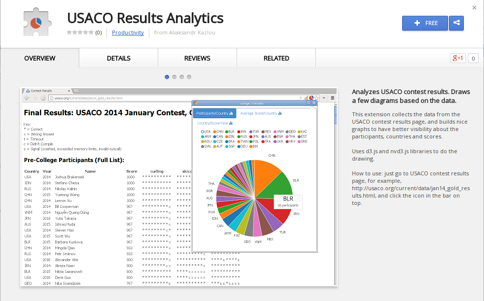

# USACO Results Analytics extension for Google Chrome

> Available in the web store: <https://chrome.google.com/webstore/detail/usaco-results-analytics/mflmefpieehbdojipdlpdclcpjheljea>

__See *prod* branch for the details how to package the extension.__

## Usage:
 - go to USACO results page, <http://usaco.org/current/data/jan14_gold_results.html>, for example
 - click the extension icon
 - see the analytics

Here is a video with extension in action:

