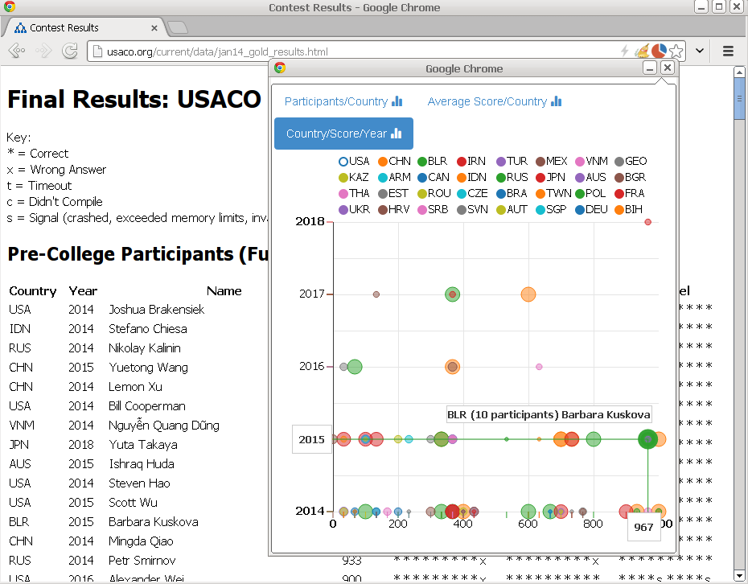

# USACO Results Analytics extension for Google Chrome

> Available in the web store
__ See *prod* branch for the details how to package the extension __

## Usage:
 - go to USACO results page, <http://usaco.org/current/data/jan14_gold_results.html>, for example
 - click the extension icon
 - see the analytics

## Screenshots

### Participants per country

### Average score per country

### Country/Score/Year

